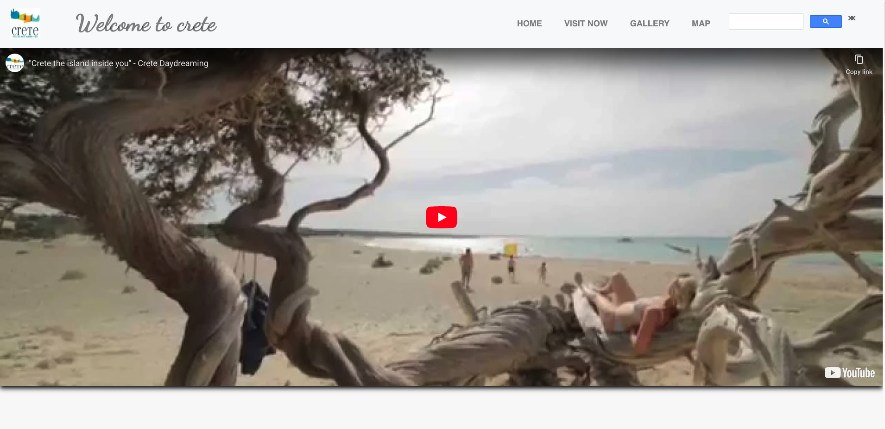
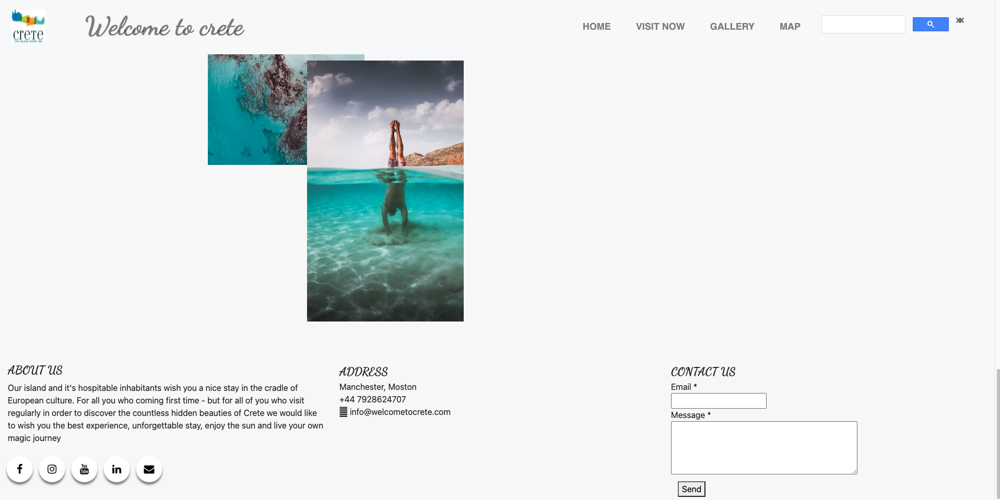
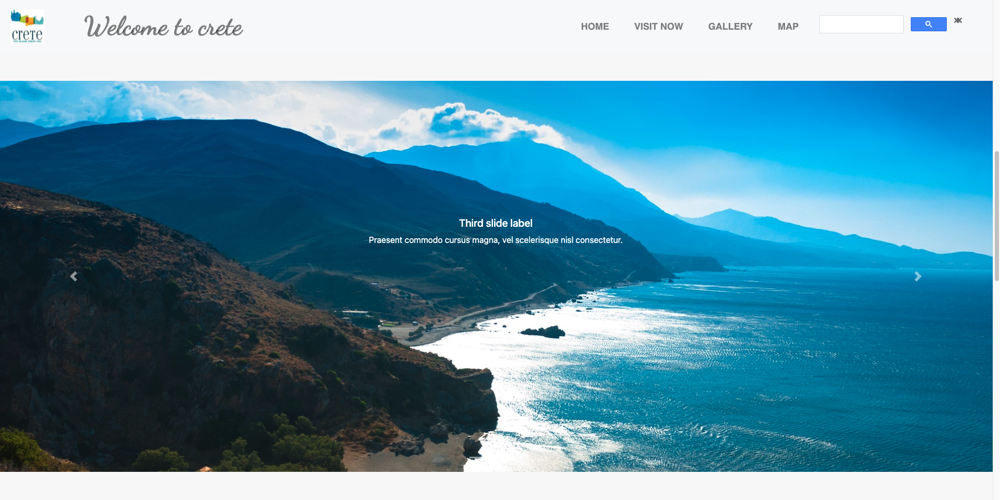
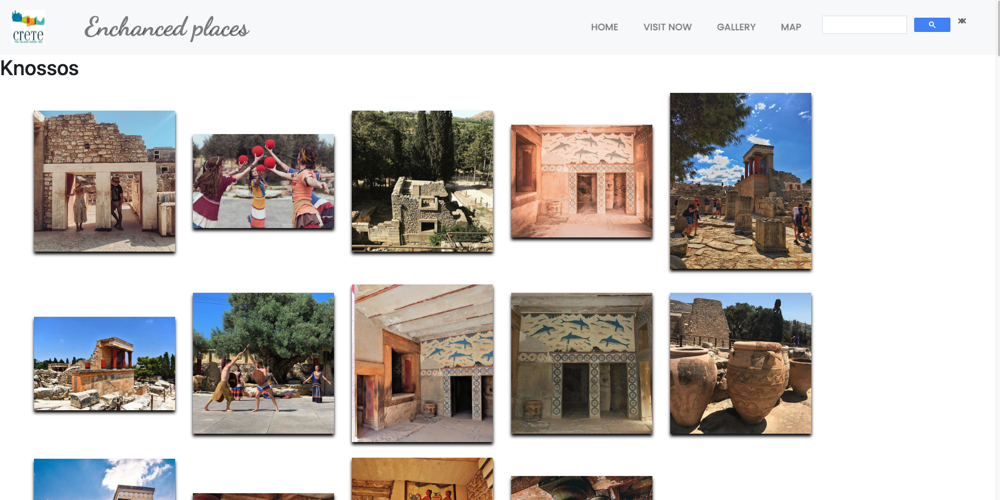
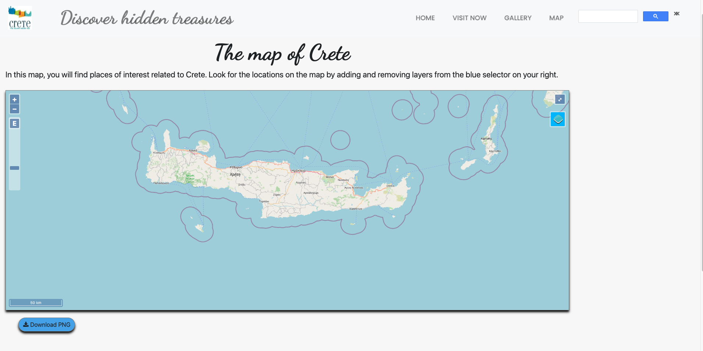
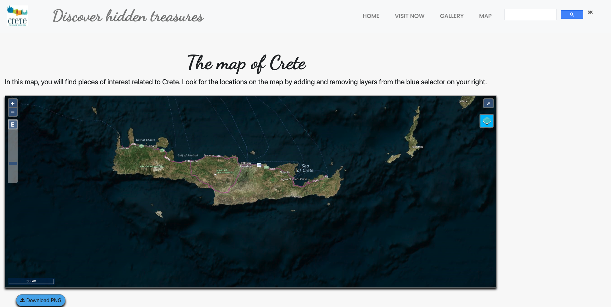
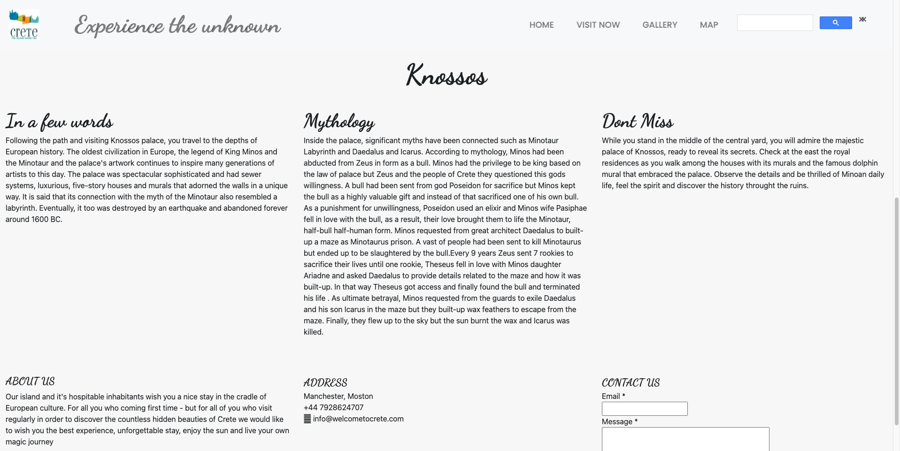

# Welcome to Crete

## Discover the paradise 

This is the Crete web site contains HTML5, CSS, and JavaScript with OpenLayers Library, working to represent the area of beauty provide information for tourism and involved with a map for various areas such as rivers, airports, lakes, swimming areas, etc

The map uses the WMS layers and local GeoJSON files to present the area of interest

Main Area

Main Area

Welcome page

Gallery

Web Map

Web Map

VIsit Information

